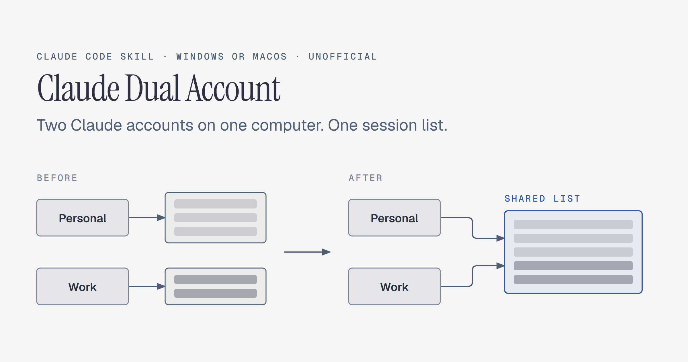

# Claude Dual Account



If you use two Claude accounts on the same computer, for example a personal and a work account, the Claude desktop app shows each account only its own sessions in the Code tab. This tool makes both accounts show the same session list. Switch account, open any session, and continue it with its full context.

That is all it does. It works on one computer, Windows or macOS, and changes nothing else in your accounts or conversations.

> [!IMPORTANT]
> Unofficial. Not affiliated with or endorsed by Anthropic. It relies on a folder layout that Anthropic does not document, so an app update can change it. A repair job handles the common case and stops safely on anything else.

## The problem

- Claude Code saves every conversation once on your computer, in `~/.claude/projects`, whatever account wrote it.
- The Claude desktop app keeps the Code tab sidebar, the session list, separately for each account.
- Switch account and the sidebar shows only that account's sessions, even though every conversation is still on disk.

## How it works

```text
claude-code-sessions/
  <account A>/<org A>/     shared folder, one local_<id>.json per session
  <account B>/<org B>  ->  link to the shared folder
```

1. The script copies the session entries of the other account into one shared folder.
2. It renames the other account's folder, which stays as a backup, and puts a link to the shared folder in its place: a junction on Windows, a symlink on macOS.
3. Both accounts now read and write the same list.
4. A repair job runs every 10 minutes, a scheduled task on Windows and a LaunchAgent on macOS. If an app update puts a real folder back, it merges the new entries and links it again. On anything it does not recognize, it changes nothing and writes an alert file.

What it touches:

- Only the session list folders and its own data folder. It never reads credentials and never touches your conversation transcripts.
- No network calls. Nothing leaves your computer.
- Nothing is deleted. It makes a backup first and keeps the original folders under a new name.

## Requirements

- One computer with the Claude desktop app and its Code tab, on Windows or macOS.
- Two Claude accounts, each signed in to the app at least once on this computer.
- Windows: an administrator PowerShell once, to register the repair task.

## Install

**Option 1: ask Claude.** In the Code tab, send:

```text
Install the skill from https://github.com/RonenBinyaminov/claude-dual-account into my personal Claude skills folder.
```

**Option 2: git.**

macOS:

```bash
git clone https://github.com/RonenBinyaminov/claude-dual-account ~/.claude/skills/claude-dual-account
```

Windows (PowerShell):

```powershell
git clone https://github.com/RonenBinyaminov/claude-dual-account "$env:USERPROFILE\.claude\skills\claude-dual-account"
```

**Option 3: ZIP.** Download `claude-dual-account.zip` from the [latest release](https://github.com/RonenBinyaminov/claude-dual-account/releases/latest) and extract it into your skills folder, so that `SKILL.md` ends up in `~/.claude/skills/claude-dual-account/` (Windows: `%USERPROFILE%\.claude\skills\claude-dual-account\`).

## Use

Open a new session in the Code tab and say:

```text
Connect my two Claude accounts to one sidebar
```

Claude checks your system, shows what it found and waits for your go. Then it applies the change, walks you through a short test, and helps you set up the repair job.

To undo, say `Undo the shared Claude sidebar`. Claude restores each account's original list, turns the repair off, and helps you remove the repair job.

## Run the scripts yourself

Without options every script only reports and changes nothing.

| Step | Windows | macOS |
| - | - | - |
| Report | no options | no options |
| Apply | `-Apply` | `--apply` |
| Choose the shared account | `-Primary '<account>\<org>'` | `--primary <account>/<org>` |
| Repair job | `claude-sidebar-sync-task.ps1 -Apply` as administrator | `--install-agent` |
| Undo | `-Rollback`, then `claude-sidebar-sync-task.ps1 -Remove` as administrator | `--rollback`, then `--remove-agent` |

- Windows: `powershell -NoProfile -ExecutionPolicy Bypass -File scripts\windows\claude-sidebar-sync.ps1 <options>`
- macOS: `bash scripts/macos/claude-sidebar-sync.sh <options>`
- The shared folder defaults to the account the app is signed in to when Claude runs the script from inside the app. From a plain terminal it defaults to the folder with the most sessions, and on macOS apply refuses while the Claude app runs, so quit it first (Cmd+Q).
- Built for two accounts. If the app holds more than two account folders, the macOS script stops, and on Windows you pass the two to join with `-Accounts uuid1,uuid2`.

## What is shared and what is not

- Shared: the Code tab session list. Any session opens with its full history on either account.
- Not shared: everything else stays with each account.
- When you continue a session on the other account, its whole history goes to that account. With a work account, check that this fits your organization's rules.

## Files

- Data folder: `%USERPROFILE%\ClaudeSharedSidebar` on Windows, `~/ClaudeSharedSidebar` on macOS. It holds the saved choices, `logs/claude-sidebar-sync.log`, `backups/`, and `ALERT-claude-sidebar-sync.txt` when something needs you.
- The original folders stay next to the links, renamed to `<org uuid>.pre-merge-<time>`.
- The repair job: scheduled task `Claude shared sidebar` on Windows, LaunchAgent `local.claude-sidebar-sync` on macOS.

> [!WARNING]
> Never delete the links recursively. In Windows PowerShell 5.1, `Remove-Item -Recurse` follows a junction and deletes the files in the shared folder. On macOS, `rm -rf <link>/` with a trailing slash does the same. Use the undo option. It removes only the link.

## Tested

- Windows 11 Pro with the Claude app from the Microsoft Store (package 2.19675.0.0). One session continued on the other account and back.
- macOS 27, both accounts show the same list.
- The classic Windows install (`%APPDATA%\Claude`) is detected but untested.

If an app update breaks it, please open an issue with your OS, the Claude app version and the alert file text.

## License

[MIT](LICENSE)
